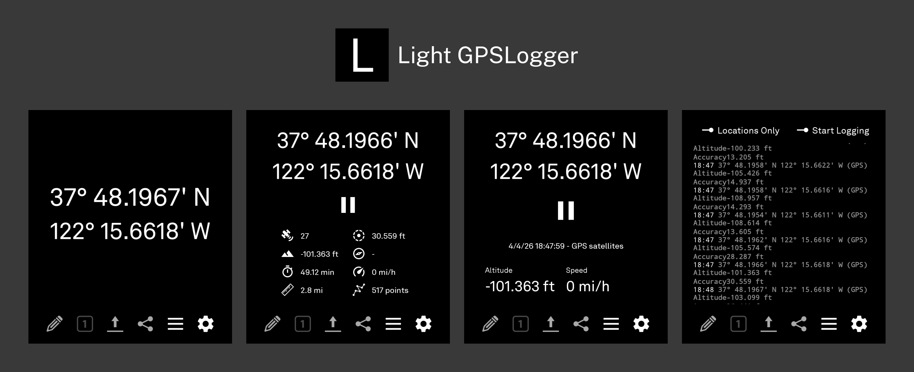

# Light GPSLogger

A Light Phone III-style reskin of [GPSLogger](https://github.com/mendhak/gpslogger/).

## Installation

> [!WARNING]
> Settings from the original GPSLogger app will not be carried over.

> [!WARNING]
> Only the Custom URL upload method has been used and tested. Other upload methods may have improper-looking UIs or may not work correctly.

I will make an effort to keep this fork updated with any GPSLogger functionality updates. The version schema is: `v<UpstreamVersion>-light<ForkVersion>`, e.g. `v135-light1`.

I recommend installing with Obtainium. Releases are also available [here](https://github.com/garado/light-gpslogger/releases).
